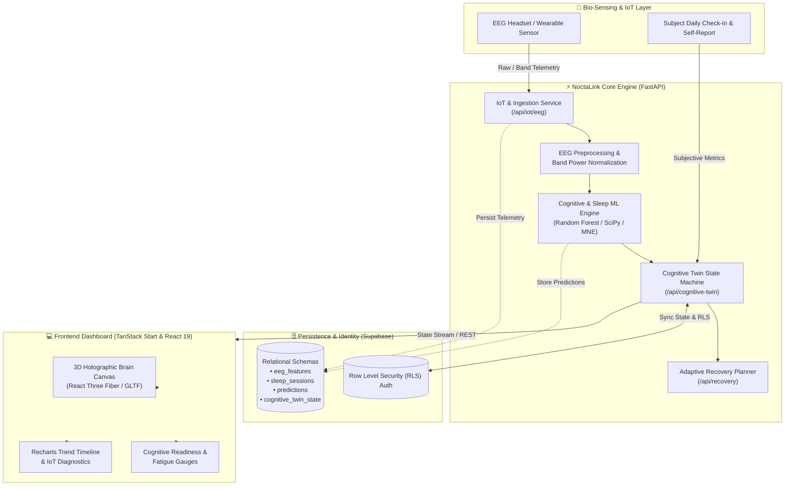

<div align="center">

# 🧠 NoctaLink
### *AI Cognitive Twin Platform linking Sleep Biomarkers to Real-Time Cognitive Performance*

[](https://fastapi.tiangolo.com)
[](https://react.dev/)
[](https://www.typescriptlang.org/)
[](https://threejs.org/)
[](https://supabase.com)
[](https://www.docker.com/)

<p align="center">
  <b>NoctaLink</b> bridges the gap between nocturnal neurophysiology and diurnal cognitive execution. By continuously synchronizing sleep polysomnography / EEG biomarkers with continuous biometric and behavioral inputs, NoctaLink constructs an adaptive, personal <b>Cognitive Twin</b> that forecasts mental fatigue, memory readiness, and optimal focus windows.
</p>

[Key Features](#-key-features) • [System Architecture](#-system-architecture) • [Tech Stack](#-tech-stack) • [Data & ML Pipeline](#-data--machine-learning-pipeline) • [Database Schema](#-database-architecture) • [Getting Started](#-getting-started) • [API Reference](#-api-endpoints)

---

</div>

## 🌟 Key Features

### 🧬 Dynamic 3D Cognitive Twin Hologram
- **Interactive WebGL Core**: Real-time rendering of an interactive 3D neural brain model using Three.js, React Three Fiber, and Drei.
- **Biometric State Shifts**: Visual pulses and state shaders dynamically adapt across states (`Calm`, `Active`, `High Load / Warning`, `Uncalibrated`) triggered by EEG theta/alpha/beta power flux.

### 📡 Real-Time IoT & EEG Streaming Integration
- **Bio-Signal Ingestion Pipeline**: Ingestion endpoints designed for EEG wearable devices streaming frequency band powers (Delta, Theta, Alpha, Beta, Gamma) and spectral ratios ($\theta/\alpha$, $\beta/\alpha$).
- **Signal Quality & Anomaly Cleansing**: Automated outlier suppression, signal noise filtering, and band power validation.

### 📊 Comprehensive Neuro-Cognitive Analytics
- **Cognitive Readiness & Load Gauges**: Instant readouts of mental capacity, processing efficiency, and fatigue headroom.
- **Sleep Architecture Breakdown**: Granular monitoring of REM, slow-wave deep sleep, spindle density, sleep latency, and sleep fragmentation.
- **Longitudinal Trendlines**: Historical tracking across days and weeks pairing sleep duration & quality against real-world cognitive performance.

### 🎯 Adaptive Recovery & Personalized Recommendations
- **Dynamic Sleep Prescriptions**: Intelligent model-driven sleep duration targets tailored to offset accumulated cognitive debt and intense workload sessions.
- **Actionable Interventions**: Micro-break alerts, circadian focus scheduling, and lifestyle habit nudges.

---

## 🏗 System Architecture



---

## 💻 Tech Stack

### Frontend
- **Framework**: [React 19](https://react.dev/) + [TanStack Start](https://tanstack.com/start) / TanStack Router
- **3D Visualization**: [Three.js](https://threejs.org/), [@react-three/fiber](https://github.com/pmndrs/react-three-fiber), [@react-three/drei](https://github.com/pmndrs/drei)
- **Styling & Animation**: [Tailwind CSS v4](https://tailwindcss.com/), [Framer Motion](https://www.framer.com/motion/), Radix UI primitives, Lucide Icons
- **Data Visualization**: [Recharts](https://recharts.org/), Canvas Gauges
- **State & Query Management**: [@tanstack/react-query](https://tanstack.com/query)

### Backend
- **Framework**: [FastAPI](https://fastapi.tiangolo.com/) (Python 3.11+)
- **Data Science & ML**: [Scikit-learn](https://scikit-learn.org/), [MNE-Python](https://mne.tools/), [Pandas](https://pandas.pydata.org/), [NumPy](https://numpy.org/), [SciPy](https://scipy.org/), [Joblib](https://joblib.readthedocs.io/)
- **Authentication & Security**: Supabase Auth (JWT), Passlib, BCrypt, PyOTP
- **Schema & Validation**: [Pydantic v2](https://docs.pydantic.dev/), Pydantic Settings

### Database & Infrastructure
- **Database**: PostgreSQL hosted via [Supabase](https://supabase.com/) with Row-Level Security (RLS) policies
- **Containerization**: Docker & Multi-stage `docker-compose` setup
- **Web Server**: Uvicorn ASGI / Nginx (for static asset production serving)

---

## 🔬 Data & Machine Learning Pipeline

NoctaLink's intelligence layer grounds itself in empirical neuroscience paradigms:

1. **Cognitive Workload Model**:
   - Inspired by the standard **n-back cognitive load protocol** (5 levels: from baseline 0-back to intense 4-back).
   - Monitors spectral dynamics: workload spikes correlate with increased frontal $\theta$ (Theta, 4–8 Hz) activity and attenuated parietal $\alpha$ (Alpha, 8–12 Hz) rhythms.
   - Outputs: Normalized **Cognitive Workload Score (0–100)**, discrete Workload Tier (1–5), and prediction confidence.

2. **Sleep Architecture & Quality Model**:
   - Synthesizes physiological features based on the **ISRUC-Sleep** polysomnographic taxonomy.
   - Computes Slow Wave Activity (SWA) from $\delta$ (Delta, 0.5–4 Hz) power, sleep spindle densities, sleep continuity, and sleep debt penalties.
   - Outputs: **Sleep Quality Score (0–100)** and recovery replenishment rates.

3. **Cognitive Twin Dynamic Update**:
   - Computes current **Cognitive Readiness** ($100 - \text{Accumulated Fatigue}$).
   - Re-evaluates readiness in response to new sleep sessions, physical strain, and real-time EEG session bursts.

---

## 🗄 Database Architecture

The system utilizes PostgreSQL (Supabase) enforced with strict user isolation via Row Level Security:

| Table | Purpose |
| :--- | :--- |
| `user_profiles` | User demographic, anthropometric, and identity profiles |
| `lifestyle_profile` | Baseline circadian rhythms, bedtime targets, and caffeine/exercise habits |
| `medical_history` | Medical conditions, neurodivergent indicators (ADHD/Anxiety), and prescription data |
| `daily_checkins` | Subjective morning/evening self-assessments (mood, stress, focus hours) |
| `sleep_sessions` | Sleep macro-architecture (duration, latency, bedtime, wakeup time, sleep score) |
| `eeg_features` | Spectral band powers ($\delta, \theta, \alpha, \beta, \gamma$), ratios, and signal quality metrics |
| `predictions` | ML-inferred cognitive states, workload indices, and confidence intervals |
| `cognitive_twin_state`| Real-time cached digital twin representations per user |
| `sleep_recommendations`| Targeted recovery recommendations, nap alerts, and sleep extension targets |

---

## 🚀 Getting Started

### Prerequisites
- [Docker & Docker Compose](https://www.docker.com/) installed **OR**
- Local environment:
  - Python 3.10+
  - Node.js 20+ & npm

---

### Option A: Running with Docker (Recommended)

1. **Clone the repository**:
   ```bash
   git clone https://github.com/kevinkr7/NoctaLink.git
   cd NoctaLink
   ```

2. **Configure Environment Variables**:
   Copy `.env.example` in `backend/` and configure your Supabase credentials:
   ```bash
   cp backend/.env.example backend/.env
   ```

3. **Start the containers**:
   ```bash
   docker-compose up --build
   ```
   - Frontend: `http://localhost:80` (or `http://localhost:3000`)
   - Backend API Docs: `http://localhost:8000/docs`

---

### Option B: Local Manual Setup

#### 1. Backend Setup
```bash
cd backend
python -m venv venv

# Windows:
venv\Scripts\activate
# Linux/macOS:
# source venv/bin/activate

pip install -r requirements.txt
cp .env.example .env
# Fill in your SUPABASE_URL, SUPABASE_KEY, and SUPABASE_SERVICE_ROLE_KEY
```

To run the backend server:
```bash
uvicorn app.main:app --reload --host 0.0.0.0 --port 8000
```

*(Optional) Train or verify ML Models:*
```bash
python -m app.ml.train
```

#### 2. Frontend Setup
```bash
cd frontend
npm install
npm run dev
```
The application will launch on `http://localhost:3000` (or Vite's active port).

---

## 📡 API Endpoints

The FastAPI backend exposes fully documented REST endpoints (available interactively at `/docs` or `/redoc`):

| Method | Endpoint | Description |
| :--- | :--- | :--- |
| `GET` | `/health` | Service health, Supabase connectivity, & ML model readiness |
| `POST` | `/api/auth/register` | User sign-up & profile initiation |
| `POST` | `/api/auth/login` | User authentication & JWT token generation |
| `POST` | `/api/iot/eeg` | Ingest real-time EEG telemetry from IoT headband/sensor |
| `POST` | `/api/iot/eeg/test` | Development EEG stream simulator endpoint |
| `GET` | `/api/cognitive-twin` | Retrieve current user's Cognitive Twin state & metrics |
| `POST` | `/api/checkin` | Submit daily subjective mood, stress, and lifestyle check-in |
| `POST` | `/api/sleep` | Upload or synchronize sleep session metrics |
| `GET` | `/api/predictions` | Query historical and current cognitive workload predictions |
| `GET` | `/api/recovery` | Obtain adaptive sleep prescriptions & recovery recommendations |

---

## 📁 Repository Layout

```
NoctaLink/
├── backend/
│   ├── app/
│   │   ├── core/              # Config, security, and auth dependencies
│   │   ├── database/          # Supabase client configurations & pooling
│   │   ├── ml/                # Scikit-learn models, features, training & inference
│   │   ├── routes/            # FastAPI route handlers (auth, iot, twin, sleep, etc.)
│   │   ├── schemas/           # Pydantic validation models & payload schemas
│   │   └── services/          # Cognitive Twin state aggregation & ingestion services
│   ├── Dockerfile             # Production backend container build
│   └── requirements.txt       # Python dependencies
├── frontend/
│   ├── src/
│   │   ├── components/        # Reusable UI & 3D WebGL components
│   │   │   ├── dashboard/     # Cognitive gauges, twin core, session monitors
│   │   │   └── three/         # Three.js Canvas and 3D Brain Hologram
│   │   ├── routes/            # TanStack router page declarations
│   │   └── utils/             # Supabase client & formatting utilities
│   ├── Dockerfile             # Production frontend container build (Nginx)
│   └── package.json           # Node.js dependencies and build scripts
├── database/                  # SQL schema definitions, migrations, and RLS policies
├── docker-compose.yml         # Full-stack container orchestration
└── README.md                  # Project documentation
```

---

## 🔒 Security & Privacy

- **Row Level Security (RLS)**: Sensitive biometric records, sleep time series, and medical profiles are restricted strictly to authenticated owners via Supabase RLS.
- **Role-Based Isolation**: Client connections utilize anonymous public keys with JWT validation, whereas internal pipelines communicate via secure Service Role context when computing cross-table twin states.
- **Biometric Data Integrity**: EEG features undergo boundary checks and normalization prior to inference.

---
